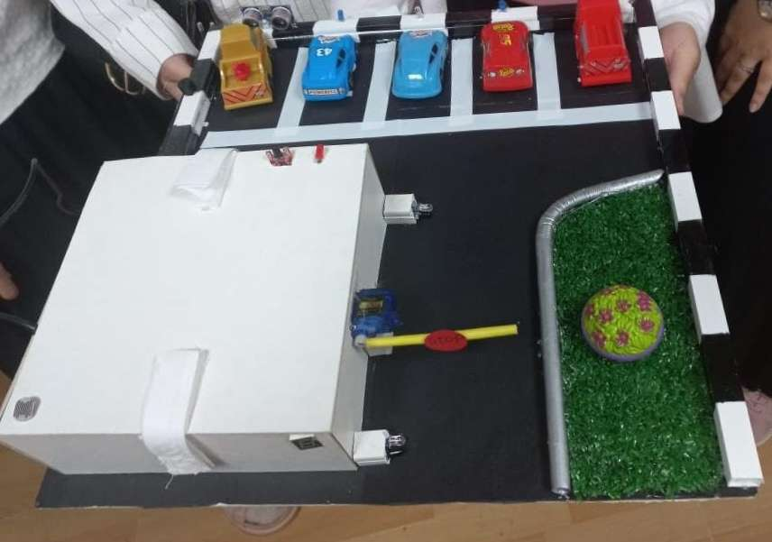
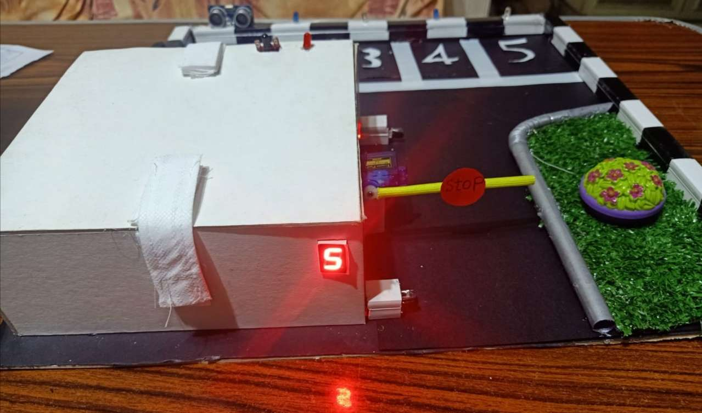
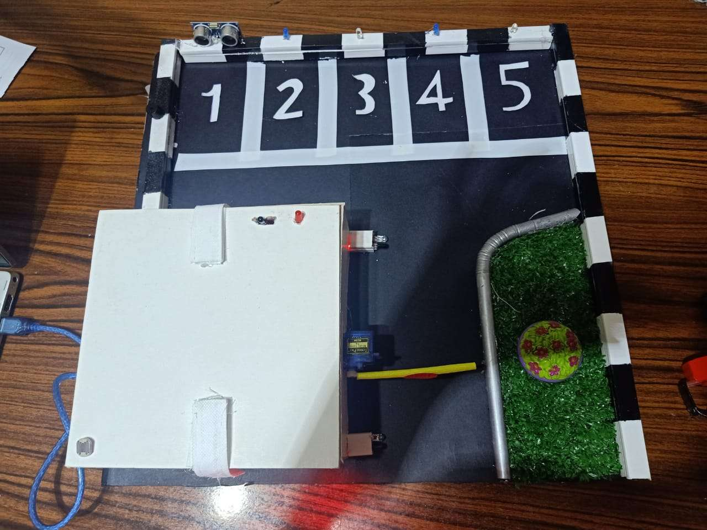

# Smart-Garage

**Smart Garage** is an Arduino-based automation system designed to enhance the safety, efficiency, and intelligence of a typical garage. This project integrates multiple sensors and modules to provide smart features such as fire detection, automated gate control, vehicle tracking, and more.

# Team Members
- Shahd Ayman Rezk
- Sama Ezz-Eldeen
- Nada Hesham
- Roaa Adb-Elazeem

# Figures

# Key Features

- **Fire Alarm System**  
  Equipped with a flame or smoke sensor to instantly detect fire or heat hazards and trigger an alert system (buzzer, red light).

- **Automatic Gate Control**  
  Uses a servo to automatically open and close the garage gate based on sensor activation.

- **Vehicle Counter**  
  Keeps track of the number of cars entering and exiting the garage using infrared sensor.

- **Distance Measurement**  
  Utilizes an ultrasonic sensor to measure the distance between a vehicle and the wall. If the car gets too close, an alert is triggered using a buzzer, helping prevent collisions.

- **Smart Lighting System**  
  A light sensor is used to detect ambient light levels. When it gets dark, the system activates lighting with varying brightness depending on how dark it is. This ensures energy efficiency and better visibility based on real-time conditions.

# Technologies & Components Used

- Arduino UNO
- Ultrasonic Sensor 
- Tempereture Sensor
- IR Sensors
- Servo Motor
- 7 segment
- Buzzer
- Red LED
- White LEDs
- Blue LEDs
- LDR
- Adaptor

